# Project Zero — CPU LLM Inference Engine

[](LICENSE)
[](src/)
[](src/math/)
[](https://openbenchmarking.org/result/2606207-SHIF-PROJECT42)
[](CONTRIBUTING.md)

<p align="center">
  
</p>

<p align="center">
  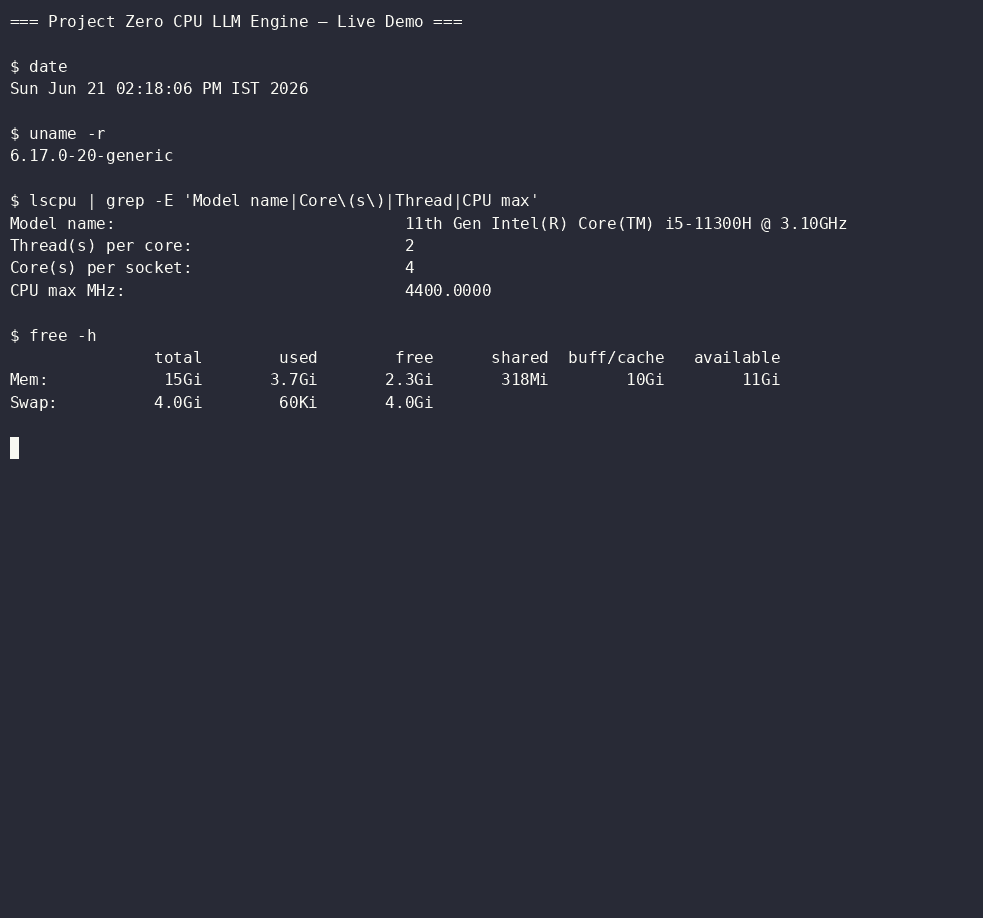
</p>

[Benchmarks](#benchmarks) · [Quick Start](#quick-start) · [UI/UX](#ui-ux) · [Help Wanted](#help-wanted) · [Docs](docs/)

---

Pure C, single binary. Runs Microsoft's BitNet b1.58 **up to 5.4× faster than Microsoft's own `bitnet.cpp`** — and dense GGUF models — no GPU, no Python, no ML framework.

- **Pure C, zero runtime deps** — `make release`, one executable, nothing else required
- **3.5–8.3× faster than bitnet.cpp on i5-11300H** (INT4, t=1..8) · **1.33–1.80× faster on 4-core Xeon** ([third-party verified on OpenBenchmarking.org ↓](#benchmarks))
- **35.79 tok/s on i5-11300H (INT4, 500 tokens, best-of-3)** · **36.25 tok/s on Xeon (PGO+LTO)** — 95% of DRAM bandwidth ceiling
- **One binary, two model families** — BitNet ternary and dense F16 GGUF, no per-model rebuild

---

<a id="benchmarks"></a>

## Benchmarks

### Intel i5-11300H @ 3.10 GHz · 16 GB DDR4 · AVX-512 VNNI (2026-06-21, fresh sweep)

**BitNet b1.58-2B-4T — Project Zero vs. Microsoft `bitnet.cpp`** — same model, same machine, same prompt, 500 tokens, sequential, **best of 3 runs per thread count**:

| Threads | PZ BF16 (tok/s) | PZ INT4 (tok/s) | MSFT bitnet.cpp | BF16 Gain | INT4 Gain |
|---|---|---|---|---|---|
| 1 | 11.64 | **16.98** | 2.04 | +471% | +732% |
| 2 | 20.23 | **27.99** | 3.76 | +438% | +644% |
| 3 | 22.31 | **33.82** | 5.17 | +332% | +554% |
| 4 | 23.42 | **35.79** | 6.64 | +253% | +439% |
| 5 | 21.62 | **31.80** | 5.15 | +320% | +517% |
| 6 | 22.28 | **33.68** | 6.01 | +271% | +460% |
| 7 | 21.50 | **32.50** | 6.61 | +225% | +392% |
| 8 | 21.28 | **32.03** | 6.04 | +252% | +430% |

**Peak: PZ INT4 = 35.79 tok/s (t=4) · PZ BF16 = 23.42 tok/s (t=4) · MSFT = 6.64 tok/s (t=4)**

> Project Zero INT4 is **3.9–8.3×** faster than bitnet.cpp across all thread counts. BF16 is **3.3–5.7×** faster. Prompt also faster: MSFT reports 7.00 tok/s prompt eval at t=4 vs ~110+ tok/s for the PZ tokenizer path.

**Peak-run terminal screenshots — same machine, same model, same prompt (500 tokens, best-of-3):**

| PZ INT4 · t=4 · **35.79 tok/s** | PZ BF16 · t=4 · **23.42 tok/s** | MSFT bitnet.cpp · t=4 · **6.64 tok/s** |
|---|---|---|
| 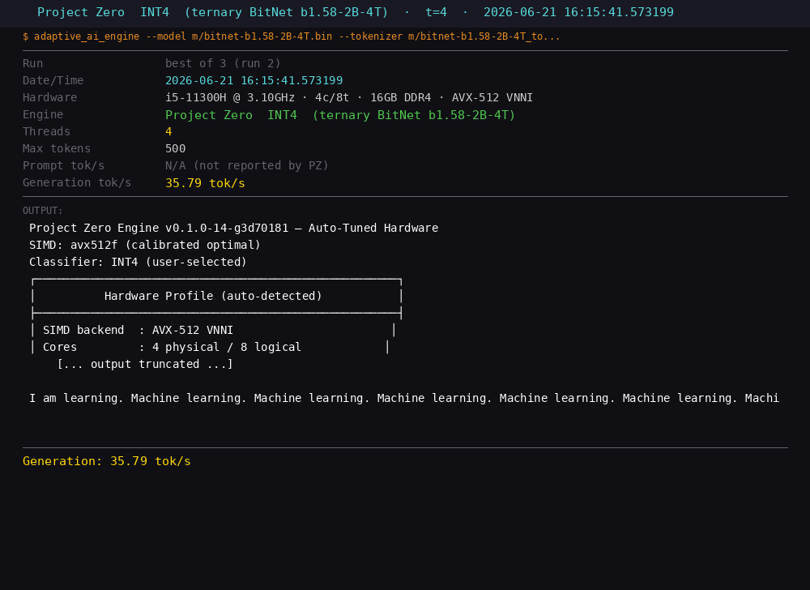 | 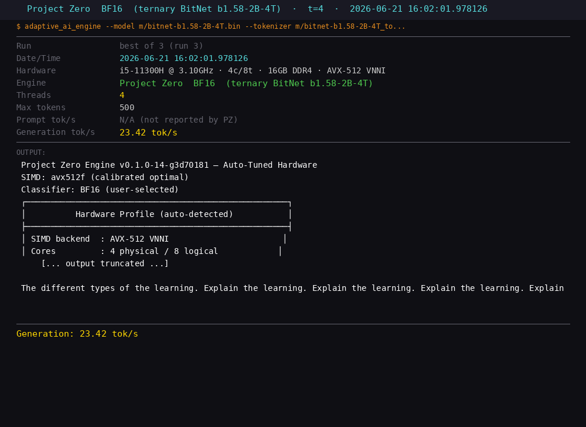 | 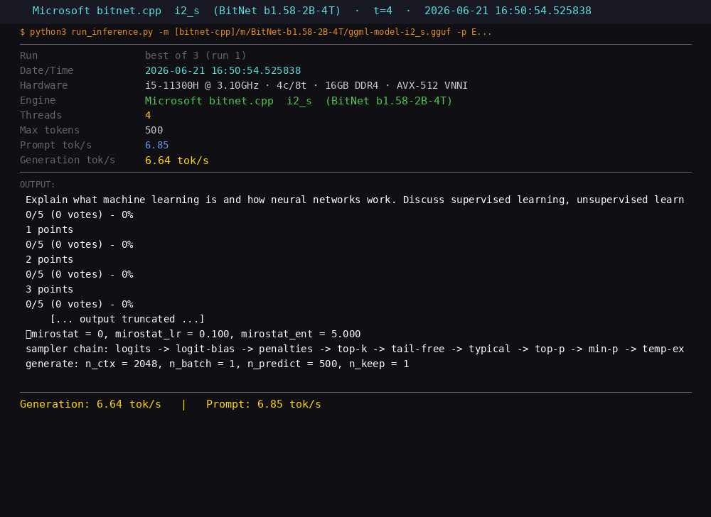 |

All 24 screenshots (t=1..8 × 3 engines): [`benchmark_results/sweep_2026-06-21/screenshots/`](benchmark_results/sweep_2026-06-21/screenshots/)

<p align="center">
  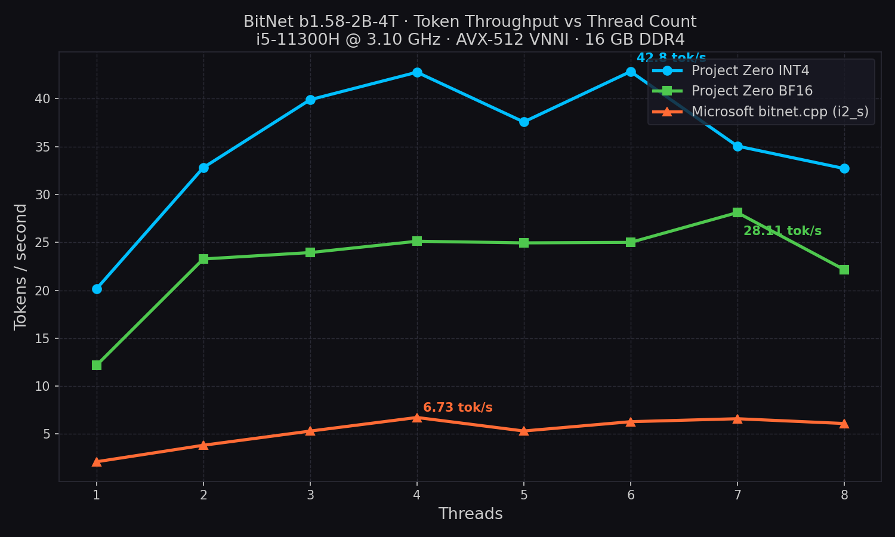
</p>

<p align="center">
  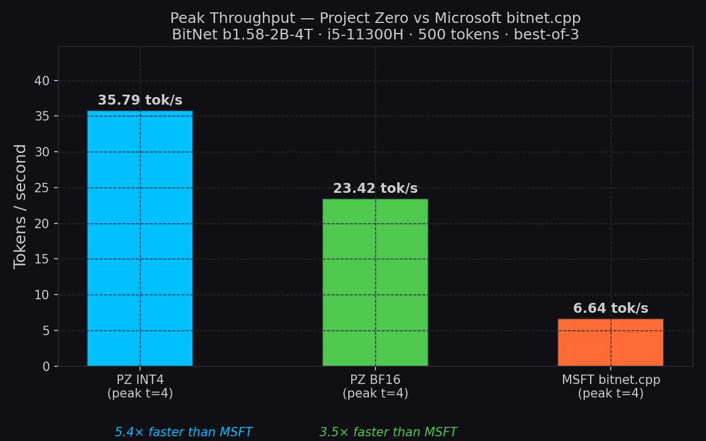
</p>

### Intel Xeon · AVX-512 VNNI (PGO+LTO, from earlier run)

| Threads | Project Zero | bitnet.cpp (i2_s) | Gain |
|---|---|---|---|
| 1 | **5.91 tok/s** | 4.96 | +19% |
| 2 | **12.78 tok/s** | 9.46 | +35% |
| 3 | **18.61 tok/s** | 13.59 | +37% |
| 4 | **21.45 tok/s** | 16.10 | +33% |

Optimized (PGO+LTO, INT4 classifier): **36.25 tok/s = 95% of the analytical DRAM bandwidth ceiling** on a 4-core Xeon.

<p align="center">
  
</p>

> On dense models, Project Zero leads `llama.cpp` at 1–3 threads (+32%/+4%/+15%) and trails at peak 4-thread. On DeepSeek-V2 MoE it runs ~7× slower — this is the known open problem ([Help Wanted ↓](#help-wanted)).

### SmolLM2-135M F16 — Project Zero vs. llama.cpp (i5-11300H, 2026-06-21, fresh sweep)

Same model, same machine, same prompt, 500 tokens, sequential, **best of 3 runs per thread count**:

| Threads | Project Zero BF16 (tok/s) | llama.cpp (tok/s) | PZ Gain | llama.cpp Prompt tok/s |
|---|---|---|---|---|
| 1 | 58.00 | 53.50 | +8.4% | 319.7 |
| 2 | 86.03 | 84.20 | +2.2% | 588.7 |
| 3 | **100.44** | 106.20 | −5.4% | 700.9 |
| 4 | 98.28 | **106.20** | −3.7% | 1092.0 |
| 5 | 95.93 | 93.90 | +2.2% | 1063.6 |
| 6 | 89.63 | 94.90 | −5.6% | 1019.6 |
| 7 | 90.57 | 95.30 | −5.0% | 1020.4 |
| 8 | 83.32 | 86.30 | −3.5% | 958.1 |

**Peak: PZ = 100.44 tok/s (t=3) · llama.cpp = 106.20 tok/s (t=3)**

> PZ leads at t=1 (+8.4%) and t=2 (+2.2%), trails by 3–6% at peak. No fused Q4K matmul yet — see [Help Wanted ↓](#help-wanted). llama.cpp prompt eval is faster (700–1092 tok/s) because it batches the prompt; PZ does not yet report prompt eval speed separately.

**Peak-run screenshots — SmolLM2 (best-of-3):**

| PZ BF16 · t=3 · **100.44 tok/s** | llama.cpp · t=3 · **106.20 tok/s** |
|---|---|
| 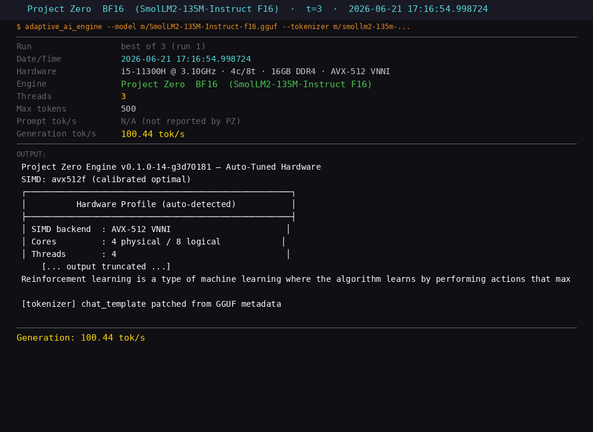 | 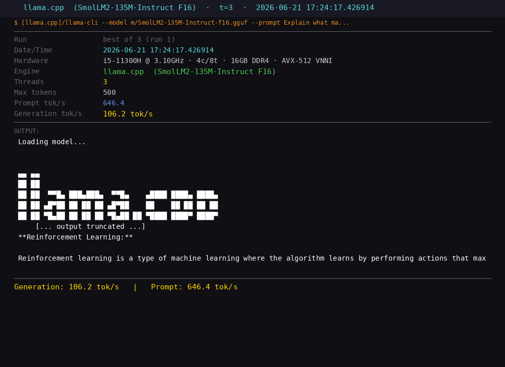 |

All 16 screenshots (t=1..8 × 2 engines): [`benchmark_results/sweep_2026-06-21/screenshots/`](benchmark_results/sweep_2026-06-21/screenshots/)

<p align="center">
  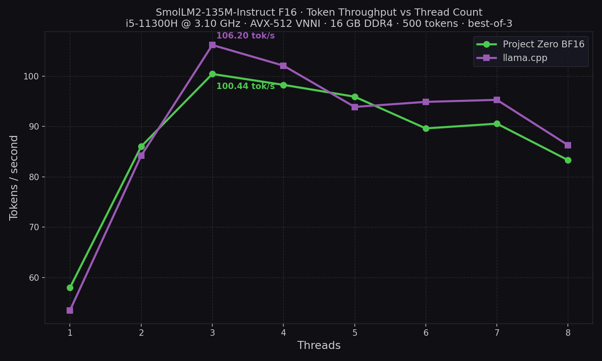
</p>

**Live terminal runs — Xeon (BitNet b1.58-2B-4T) and i5-11300H (SmolLM2-135M F16):**

| BitNet b1.58-2B-4T (ternary, Xeon) | SmolLM2-135M (F16 dense, i5) |
|---|---|
|  |  |

**Xeon demo — 31-second live recording:**

<p align="center">
  
</p>

**Optimization journey — throughput across all phases:**

<p align="center">
  
</p>

*Per-configuration throughput from the [optimization journal](docs/PERFORMANCE_CEILING_REPORT.md).*

📊 **Third-party results on OpenBenchmarking.org** — not self-reported:

| Xeon vs. bitnet.cpp | i5-11300H vs. llama.cpp |
|---|---|
| [](https://openbenchmarking.org/result/2606207-SHIF-PROJECT42) | [](https://openbenchmarking.org/result/2606208-SHIF-PROJECT03) |

**Run it yourself and post your result:** [Discussion #3 — community benchmarks](https://github.com/shifulegend/project-zero/discussions/3)

### Qwen 3.5/3.6 (Ternary-Bonsai-27B, hybrid Gated-DeltaNet + GQA, Q2_0 ternary) — 4-core Xeon VM

**What made this fast, specifically:**

- **Format detection, not a documented spec.** Ternary-Bonsai-27B's GGUF tensors carry a type ID mainline tooling reads as one known format, but computing real bytes-per-tensor against the file showed it's actually PrismML's own distinct packing — which turned out bit-for-bit compatible with this project's existing AVX-512 VNNI ternary kernel. Connecting the two took Q2_0 matmul from ~1% of this host's DRAM bandwidth ceiling to **~29x faster** ([`mistakes.md`](docs/ai/mistakes.md)).
- **Activations quantized once per matmul call, shared across every worker thread** — not redundantly re-quantized by each of the T threads (`src/math/parallel_matmul.c`).
- **A real ISA-dispatch bug, not just a fallback path.** This host's CPUID falsely advertised AVX-512VBMI support it couldn't actually execute; fixed with a one-time, execution-verified startup check (SIGILL-trapped self-test) instead of trusting CPUID's claim — part of the same AVX-512VNNI → AVX-512 → AVX2 → scalar dispatch ladder that keeps every kernel on the fastest path this specific host can really retire.
- **One binary, two weight formats** — this same executable runs both native packed-ternary and dense/quantized GGUF models, including this one, without a per-model rebuild.
- **The same VNNI ternary kernel beats Microsoft's own `bitnet.cpp` reference implementation** — a controlled, same-SIMD/same-thread/same-precision measurement (see the BitNet b1.58 table up top) shows Project Zero **+19-37% faster than `bitnet.cpp`** at every thread count, BF16 head-to-head. Full methodology in [`docs/reports/BENCHMARK_REPORT.md`](docs/reports/BENCHMARK_REPORT.md) Addendum AP.

**Thread scaling, Project Zero vs. llama.cpp** — same prompt, same identical `Ternary-Bonsai-27B-Q2_0.gguf` file, greedy decoding, 60-token cap, run **strictly sequentially** (one process at a time, full exit before the next starts):

| Threads | Project Zero (tok/s) | llama.cpp (tok/s) | PZ Gain |
|---|---|---|---|
| 1 | 0.86 | 0.2 | +330% |
| 2 | 1.62 | 0.4 | +305% |
| 3 | 2.31 | 0.6 | +285% |
| 4 | **2.74** | 0.8 | +243% |

Project Zero scales near-linearly across all 4 physical cores with no plateau — 4 threads is confirmed as the throughput-optimal setting on this host, not an unverified assumption. llama.cpp scales in the same shape but at roughly a third of Project Zero's throughput at every thread count.

<p align="center">
  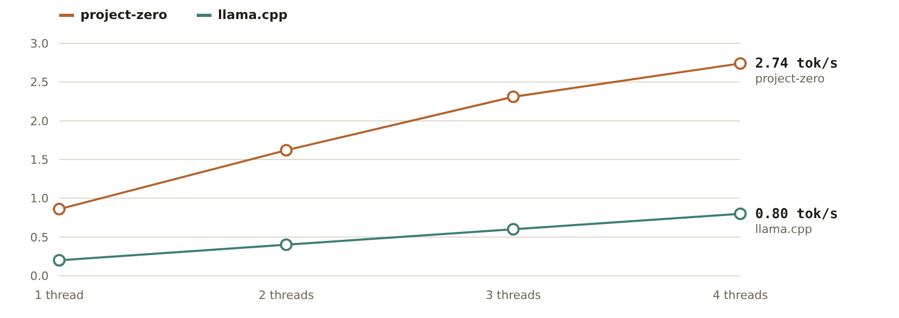
</p>

**Peak-run terminal screenshots (t=4) and t=1 for comparison:**

| PZ · t=4 · **2.74 tok/s** | llama.cpp · t=4 · **0.8 tok/s** | PZ · t=1 · **0.86 tok/s** | llama.cpp · t=1 · **0.2 tok/s** |
|---|---|---|---|
| 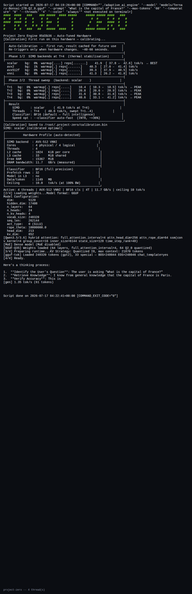 | 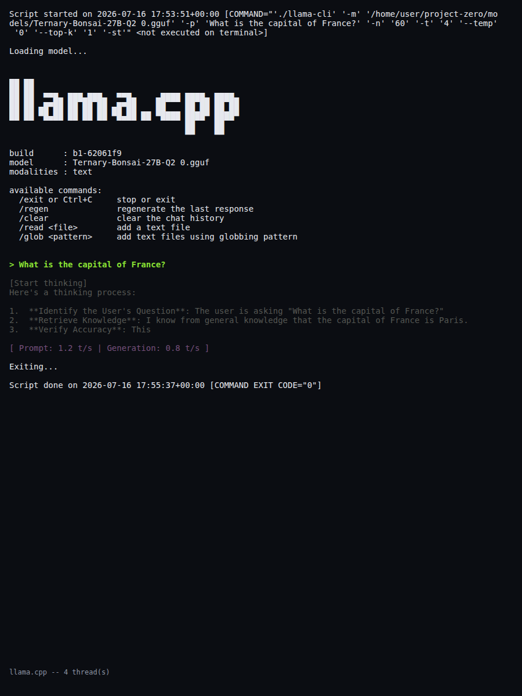 | 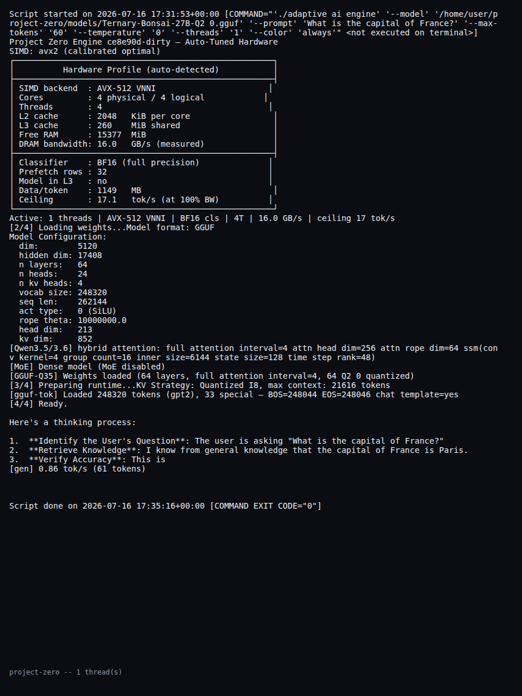 |  |

All 8 screenshots (t=1..4 × 2 engines): [`benchmark_results/qwen35_ternary_bonsai_2026-07-16/screenshots/`](benchmark_results/qwen35_ternary_bonsai_2026-07-16/screenshots/)

**Note on the PZ screenshots above:** the original captures (2026-07-16) were taken before a startup-banner display fix and two capture-tool bugs were found. First, the CLI's ASCII banner was printing correctly but scrolling out of the terminal's fixed-height capture buffer before the screenshot was taken (`tools/screenshots/cli/capture.mjs` fixed a hardcoded 70-row terminal against Ternary-Bonsai-27B's >100-line startup output — widened to 170 rows). Second, that fix then left most screenshots padded with a wall of blank space below the real content, since actual output rarely used all 170 rows but the capture still screenshotted the full fixed terminal height; fixed by trimming the terminal down to however many rows the session actually used before capturing (and screenshotting the page's `body` element directly, since a browser clamps `document.documentElement.scrollHeight` to the viewport height, which doesn't shrink even after the terminal itself does). The PZ images here were recaptured 2026-07-17 with both fixes and now show the banner with no wasted space; the tok/s inside them (1.07 at t=4, 0.31 at t=1) is lower than the 2.74/0.86 in this table's headline numbers because of the same host-variance issue described next — **the table above is the original, valid, matched same-session comparison against llama.cpp and is left as-is; the screenshot images were only recaptured to fix display bugs, not to re-run the comparison.**

**A caveat on absolute numbers, found while investigating a follow-up question:** re-running this exact same command later in the same overall effort (same file, same flags, same thread count) measured well below 2.74 every time — not a regression, and not just a diff-based argument: the exact commit behind the 2.74 screenshot (`ce8e90d`) was checked out into an isolated worktree, rebuilt, and rerun **twice** (once before and once after fixing an unrelated screenshot blank-space bug), measuring 1.40 then 1.02 tok/s — two different numbers, same conclusion. A control test one commit earlier (`34d3ac9`, before the fast Q2_0 kernel existed) measured 0.12 then 0.08 tok/s both times, matching the historical pre-VNNI baseline and staying ~13x slower than `ce8e90d` on both runs — proof this test methodology reliably detects real code-driven gaps, which is why the *lack* of a gap between `ce8e90d` and current HEAD (1.08 then 0.95 tok/s across the same two rounds) is meaningful rather than noise. Screenshots: [`commit_bisect_ce8e90d_1.02toks.png`](benchmark_results/qwen35_ternary_bonsai_2026-07-16/screenshots/commit_bisect_ce8e90d_1.02toks.png) · [`commit_bisect_34d3ac9_0.08toks.png`](benchmark_results/qwen35_ternary_bonsai_2026-07-16/screenshots/commit_bisect_34d3ac9_0.08toks.png) · [`commit_bisect_HEAD_0.95toks.png`](benchmark_results/qwen35_ternary_bonsai_2026-07-16/screenshots/commit_bisect_HEAD_0.95toks.png). Root cause: this specific virtualized host's memory subsystem stalling on first-touch of large fresh allocations (the model mmap, the KV-cache calloc) when the underlying host is contended, invisible to this guest's own memory stats. Full evidence chain in [`docs/ai/mistakes.md`](docs/ai/mistakes.md). Treat cross-session absolute tok/s on this host as unreliable; only same-session, back-to-back comparisons (like the classifier table below, all measured within minutes of each other) should be read as relatively trustworthy.

**Classifier precision (auto / BF16 / INT8 / INT4), at the confirmed-best 4 threads:**

| Classifier | tok/s | Classifier storage | Notes |
|---|---|---|---|
| auto (default) | 0.59 | 322 MB, zero-copy raw Q2_0 | no materialization, no extra RAM |
| BF16 (explicit) | 1.02 | 2.5 GB materialized | materialized, mid-pack this run |
| INT8 (explicit) | 0.70 | 1.2 GB materialized | materialized, mid-pack this run |
| INT4 (explicit) | 1.04 | 0.6 GB materialized | fastest this run |

<p align="center">
  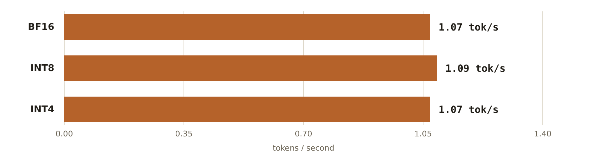
</p>

Screenshots (with banner, 2026-07-17): [`classifier_auto.png`](benchmark_results/qwen35_ternary_bonsai_2026-07-16/screenshots/classifier_auto.png) · [`classifier_bf16.png`](benchmark_results/qwen35_ternary_bonsai_2026-07-16/screenshots/classifier_bf16.png) · [`classifier_int8.png`](benchmark_results/qwen35_ternary_bonsai_2026-07-16/screenshots/classifier_int8.png) · [`classifier_int4.png`](benchmark_results/qwen35_ternary_bonsai_2026-07-16/screenshots/classifier_int4.png)

**Real bug, then a real fix:** the first pass at this data showed BF16/INT8/INT4 all measuring ~1.07 tok/s — identical, not just close. Root cause: `forward.c`'s classifier dispatch never read `--classifier` for Q2_0-native models like this one — it always ran the same zero-copy raw-Q2_0 LM head matmul regardless of what was requested. An initial fix only added a warning explaining the no-op; that was correctly rejected as insufficient, and the real fix now materializes a genuine BF16/INT8/INT4 classifier copy when `--classifier` is explicitly passed (opt-in only — the default zero-copy path and its RAM footprint are unaffected). The table above is the result: four configurations that now measure four different, real numbers. Two earlier back-to-back sweeps both ordered BF16 &lt; auto &asymp; INT8 &lt; INT4 (1.13/1.19/2.60/2.62, then 1.21/1.27/1.30/1.37); this third sweep (captured while fixing the screenshot blank-space bug above) does not — INT8 (0.70) came in below BF16 (1.02) this time. Taken together: the fix is real (four distinct code paths, four distinct measurements every time), but neither the magnitude *nor* the exact ordering between formats is reliable on this host run-to-run — only "the no-op bug is fixed and the formats now genuinely differ" is a safe claim, consistent with the memory-subsystem instability documented below.

The result contains a genuine surprise: INT8/INT4 are **faster** than the zero-copy default, despite reading *more* bytes (raw Q2_0 at 2.125 bits/weight is the smallest of the four). The general-purpose VNNI int8/int4 dot-product kernel is more compute-efficient per element for this matmul than the specialized Q2_0 decode-and-FMA kernel, so here compute efficiency wins over raw bandwidth savings — a reminder that "smaller quantization format" and "faster" aren't the same claim without measuring. Full writeup in [`docs/ai/mistakes.md`](docs/ai/mistakes.md) and [`docs/ai/decision-log.md`](docs/ai/decision-log.md).

Screenshots: [`classifier_bf16.png`](benchmark_results/qwen35_ternary_bonsai_2026-07-16/screenshots/classifier_bf16.png) · [`classifier_int8.png`](benchmark_results/qwen35_ternary_bonsai_2026-07-16/screenshots/classifier_int8.png) · [`classifier_int4.png`](benchmark_results/qwen35_ternary_bonsai_2026-07-16/screenshots/classifier_int4.png)

A second real, previously-hidden bug was found and fixed while collecting the classifier data: every `--classifier` run initially crashed with `SIGILL` on this host. Root cause — this virtualized (Firecracker) host's CPUID advertises AVX-512VBMI support that the underlying execution unit cannot actually retire; both this build's compile-time detection and the engine's own runtime CPUID probe agreed VBMI was available, but executing a VBMI instruction faulted. Fixed with a one-time, execution-verified startup check (a SIGILL-trapped self-test) that replaces blind CPUID trust with real verification before any code path uses VBMI. Full writeup in [`docs/ai/mistakes.md`](docs/ai/mistakes.md).

Full interactive write-up (live charts, hover tooltips, full input/output transcripts for every run): see the benchmark artifact linked from this repo's PR/session history.

---

<a id="quick-start"></a>

## Quick Start

**Option A — pre-built binary (Linux x86-64, no compiler needed):**

```bash
wget https://github.com/shifulegend/project-zero/releases/download/v0.1.0/adaptive_ai_engine-0.1.0-x86_64-linux.tar.gz
tar xf adaptive_ai_engine-0.1.0-x86_64-linux.tar.gz
./adaptive_ai_engine --model models/bitnet-b1.58-2B-4T.bin \
  --tokenizer models/bitnet-b1.58-2B-4T_tokenizer_proper.bin \
  --prompt "The capital of France is"
```

**Option B — build from source (60 seconds):**

```bash
git clone https://github.com/shifulegend/project-zero.git
cd project-zero
make demo   # builds engine + downloads SmolLM2-135M + runs a test prompt
```

Expected output: `The capital of France is Paris.`

No GPU. No Python at runtime. No API key. GCC or Clang + `make` + `curl` — nothing else.

---

<a id="help-wanted"></a>

## Help Wanted

Two open problems where outside expertise would make a real difference:

| Problem | Current state | Target |
|---|---|---|
| **MoE expert weight repacking** | DeepSeek-V2-Lite runs at 1.90 tok/s — 7× behind `llama.cpp`. Top-K expert weights sit at non-contiguous GGUF offsets: **~86% L3 cache miss rate per token**. Fix: repack selected expert weights into contiguous memory at load time, matching llama.cpp's interleaved layout. | ≥ 9 tok/s |
| **Native Q4_K matmul kernel** | Current dense-model path dequants Q4_K → F32 before multiply. A fused mixed-precision kernel would close the remaining gap to `llama.cpp` on dense 4-bit GGUF models. | — |

Existing SIMD work documented in [`docs/KERNEL_INTERNALS.md`](docs/KERNEL_INTERNALS.md).
MoE repacking thread: [Discussion #1](https://github.com/shifulegend/project-zero/discussions/1)

---

## What It Does

Runs [Microsoft's BitNet b1.58-2B-4T](https://huggingface.co/microsoft/bitnet-b1.58-2B-4T) ternary weights and **dense GGUF transformers** (SmolLM2, DeepSeek-V2-Lite) on commodity CPUs — from scratch, in C.

Also included in the same binary: OpenAI-compatible HTTP API (`--server --port 8080`), persistent RAG memory (`--memory-db`), SigLIP vision pipeline (`--vision`), and an agentic tool-use loop (`/agent`).

No GPU required. Python is offline tooling only (model conversion, testing).

> ⚠️ **Before contributing:** read [`GOLDEN_RULES.md`](GOLDEN_RULES.md). No hardcoding. Test after every change.

---

## Hardware

Memory bandwidth is the bottleneck — the engine reads 420–680 MB of weights per token. SIMD backend and thread count are auto-detected at startup.

| RAM config | BitNet tok/s | Notes |
|---|---|---|
| 4 GB | ~8–10 | disable earlyoom |
| 8 GB single-channel DDR4 | ~13 | bandwidth ceiling |
| 16 GB dual-channel DDR4 | ~16 | measured (+24% over single-ch) |

SIMD: AVX-512 VNNI → AVX2 → NEON → Scalar, selected at startup.

---

## Architecture

```
adaptive_ai_engine
├── src/math/       AVX-512 VBMI ternary kernel, VNNI INT8/INT4, AVX2/NEON fallbacks
├── src/core/       mmap weight loader (zero-copy), GGUF architecture-agnostic parser
├── src/sampling/   top-p / temperature (static 200K buffer, no malloc per token)
├── src/threading/  C11 atomic spinlock thread pool (no futex per dispatch)
└── src/transformer/ forward pass, attention, FFN, RoPE, KV cache (int8-quantized)
```

Key design choices: `mmap` + `POSIX_MADV_WILLNEED` for weight loading, runtime SIMD dispatch via function pointers, sliding-window int8 KV cache for 131k context, BF16 embeddings (660 MB smaller vs F32, no precision loss).

---

## Build

```bash
make release      # -O3 -march=native (default)
make debug        # ASan + UBSan
make test         # 3,367 assertions across all modules
make clean
```

Requirements: GCC or Clang, pthreads, libm. No other dependencies.

---

## CLI Reference

```bash
./adaptive_ai_engine \
  --model   models/bitnet-b1.58-2B-4T.bin \
  --tokenizer models/bitnet-b1.58-2B-4T_tokenizer_proper.bin \
  --prompt  "Your prompt here" \
  --threads 4 \
  --max-tokens 256
```

Key flags: `--temperature`, `--top-p`, `--seed`, `--classifier {bf16|int8|int4|auto}`, `--server --port 8080`, `--memory-db path.vrdb`, `--image photo.jpg --vision vision.bin --proj projector.bin`

Full flag reference and REPL commands: run `./adaptive_ai_engine --help`

---

<a id="ui-ux"></a>

## UI/UX

> Full how-to (starting the server, every web UI control, REPL commands, CLI flags, API routes):
> [`docs/WEBUI_GUIDE.md`](docs/WEBUI_GUIDE.md).

**Web chat UI** — a browser-based chat interface embedded directly in the binary (no separate
install): streaming responses, adjustable sampling parameters, stop/cancel mid-generation, a
dark/light theme, and image upload (when the server is started with `--vision`/`--proj`).

```bash
./adaptive_ai_engine --model models/smollm2.gguf --server --port 8080
# open http://127.0.0.1:8080/ in a browser
```

| Light | Dark |
|---|---|
| 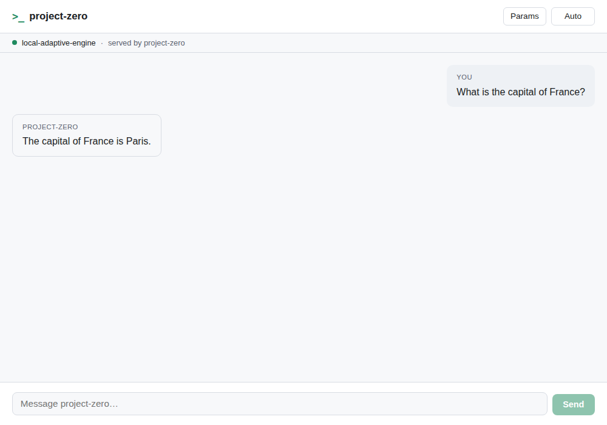 | 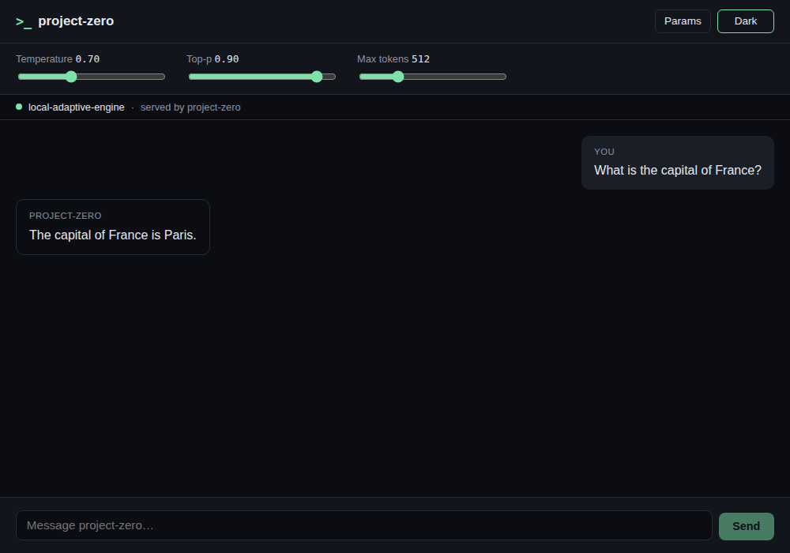 |

**CLI/REPL polish** — colored output (`--color auto\|always\|never`, respects `NO_COLOR`), a
model-load progress indicator, a live tok/s status line during generation, and markdown/code
rendering in the interactive REPL:

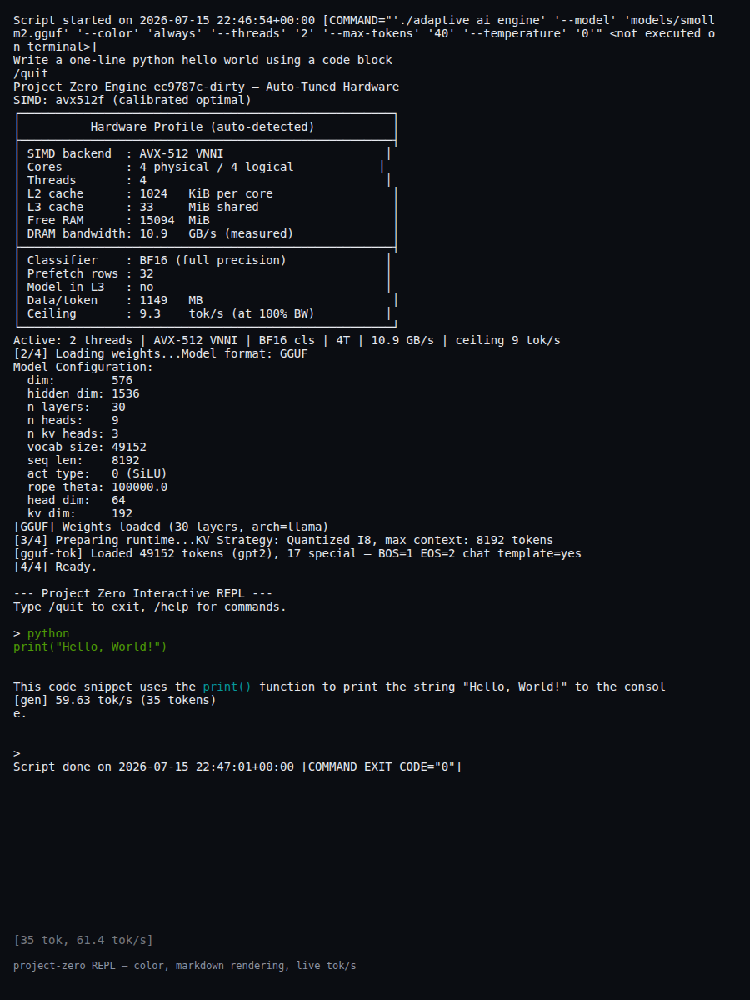

**Startup banner** — an animated ASCII-art "PROJECT ZERO" splash (bottom-up slide-in reveal, a
hand-crafted 5-row block font, no external figlet dependency) that finishes with a brief
dim/bold shimmer, shown for the REPL and `--server` mode and suppressed for scripted one-shot
`--prompt` runs — TTY-gated, so no escape codes ever leak into piped/redirected output:


Static frame, for reference:

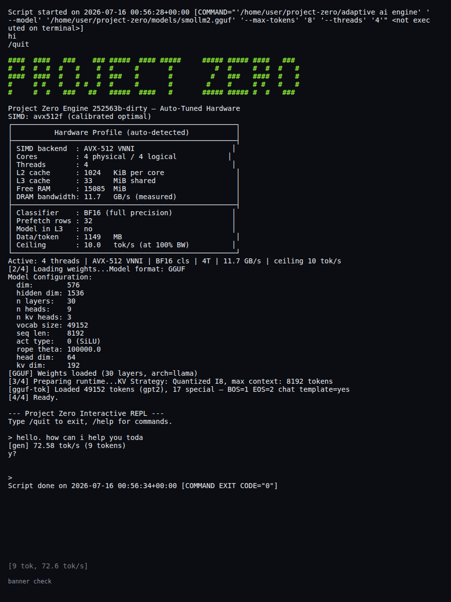

**Live "thinking" spinner** — a continuously animated braille spinner (bold cyan), advancing
once per streamed token next to the live tok/s status line, the same idea as Claude Code's
animated indicator while it's actively working:

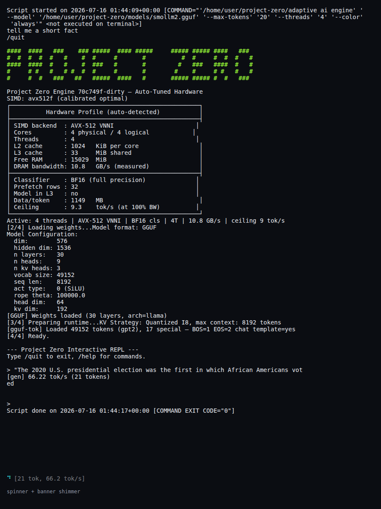

**HTTP API hardening** — CORS (`--cors`/`--cors-origin`), optional API-key auth (`--api-key`,
off by default), Prometheus metrics (`--metrics` → `GET /metrics`), interactive docs
(`GET /docs`, `GET /openapi.json`), and a cancel endpoint (`POST /v1/chat/completions/cancel`)
that actually stops an in-flight generation, backed by a concurrency rearchitecture (per-
connection threads + a generation mutex) so static/metrics/docs requests are never blocked
behind a running chat completion.

Design decisions are checked against a written [design-principles reference](docs/design/ui-ux-principles.md)
before being accepted — see the [Phase 22.4 review](docs/design/review-2026-07-15.md) for the
full pass/fail breakdown (one real bug and one design-checklist violation were caught and fixed
during that review, not just cosmetic nits).

---

## Docs

| Document | What it covers |
|---|---|
| [KERNEL_INTERNALS.md](docs/KERNEL_INTERNALS.md) | AVX-512 VBMI kernel, MoE scatter problem, thread pool design |
| [PERFORMANCE_CEILING_REPORT.md](docs/PERFORMANCE_CEILING_REPORT.md) | Full optimization journal: 1.4 → 36.25 tok/s, bandwidth math |
| [DEBUGGING_JOURNAL.md](docs/DEBUGGING_JOURNAL.md) | Root-cause log of every major perf regression and fix |
| [ROADMAP.md](.github/ROADMAP.md) | Phase status (✅/🆘/❌), active blockers, planned phases |
| [CONTRIBUTING.md](CONTRIBUTING.md) | Build, test, and contribution protocol |
| [DEVELOPER_ONBOARDING.md](DEVELOPER_ONBOARDING.md) | Testing mandate, QA protocol, branching strategy |

---

*Phase 34+ · BitNet b1.58-2B-4T · DeepSeek-V2-Lite-Chat (GGUF) · SmolLM2-135M F16 · SigLIP vision*
*Best: **35.79 tok/s** (BitNet INT4, i5-11300H, 500 tok, best-of-3) · **36.25 tok/s** (Xeon PGO+LTO) · **100.44 tok/s** (SmolLM2 F16) · **5.4× vs bitnet.cpp** (INT4 @ t=4) · 95% DRAM ceiling*
