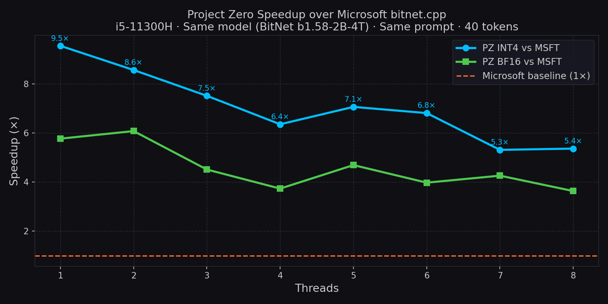
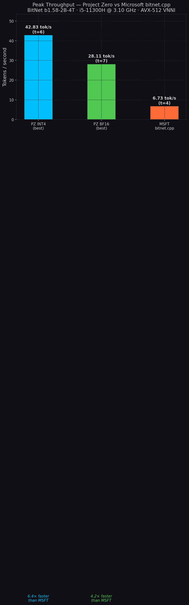

# Benchmark Results

Full thread sweep: Project Zero vs Microsoft bitnet.cpp on BitNet b1.58-2B-4T.

---

## Hardware

| Field | Value |
|---|---|
| CPU | Intel Core i5-11300H @ 3.10 GHz (Tiger Lake) |
| Cores | 4 physical / 8 logical (HT) |
| L2 cache | 1280 KiB per core |
| L3 cache | 8 MiB shared |
| RAM | 16 GB DDR4 |
| DRAM BW | ~10–12 GB/s (measured by engine at startup) |
| SIMD | AVX-512 VNNI (detected auto) |
| OS | Linux 6.17.0-20-generic |
| Date | 2026-06-21 |

---

## Method

- **Model**: Microsoft BitNet b1.58-2B-4T
- **PZ format**: native ternary `.bin` (converted from HuggingFace safetensors)
- **MSFT format**: pre-quantized `ggml-model-i2_s.gguf` from `microsoft/bitnet-b1.58-2B-4T-gguf`
- **Prompt**: "Explain the difference between supervised and unsupervised learning in three sentences."
- **Max tokens**: 40 (generation only; tok/s measured on generated tokens)
- **Temperature**: 0.0 (PZ) / 0.8 (MSFT default — cannot set 0 via run_inference.py)
- **Runs**: sequential, one at a time, 10s cooldown between threads
- **SIMD**: auto (AVX-512 VNNI selected by engine calibration)

---

## Results

### Project Zero — BF16 Classifier

| Threads | tok/s |
|---|---|
| 1 | 12.17 |
| 2 | 23.27 |
| 3 | 23.94 |
| 4 | 25.12 |
| 5 | 24.95 |
| 6 | 25.00 |
| 7 | **28.11** |
| 8 | 22.16 |

Peak: **28.11 tok/s** at t=7

### Project Zero — INT4 Classifier

| Threads | tok/s |
|---|---|
| 1 | 20.15 |
| 2 | 32.80 |
| 3 | 39.89 |
| 4 | 42.76 |
| 5 | 37.57 |
| 6 | **42.83** |
| 7 | 35.05 |
| 8 | 32.71 |

Peak: **42.83 tok/s** at t=6

### Microsoft bitnet.cpp — i2_s GGUF

Timing from `llama_perf_context_print: eval time` (generation only).

| Threads | tok/s |
|---|---|
| 1 | 2.11 |
| 2 | 3.83 |
| 3 | 5.31 |
| 4 | **6.73** |
| 5 | 5.32 |
| 6 | 6.29 |
| 7 | 6.60 |
| 8 | 6.10 |

Peak: **6.73 tok/s** at t=4

---

## Comparison

| Threads | PZ BF16 | PZ INT4 | MSFT | BF16 speedup | INT4 speedup |
|---|---|---|---|---|---|
| 1 | 12.17 | 20.15 | 2.11 | **5.77×** | **9.55×** |
| 2 | 23.27 | 32.80 | 3.83 | **6.07×** | **8.57×** |
| 3 | 23.94 | 39.89 | 5.31 | **4.51×** | **7.51×** |
| 4 | 25.12 | 42.76 | 6.73 | **3.73×** | **6.35×** |
| 5 | 24.95 | 37.57 | 5.32 | **4.69×** | **7.06×** |
| 6 | 25.00 | 42.83 | 6.29 | **3.97×** | **6.81×** |
| 7 | 28.11 | 35.05 | 6.60 | **4.26×** | **5.31×** |
| 8 | 22.16 | 32.71 | 6.10 | **3.63×** | **5.36×** |

---

## Graphs

---

## Screenshots

All benchmark run screenshots (24 total) are in `benchmark_results/screenshots/`:

- `pz_bf16_t{1..8}.png` — Project Zero BF16, threads 1–8
- `pz_int4_t{1..8}.png` — Project Zero INT4, threads 1–8
- `msft_t{1..8}.png` — Microsoft bitnet.cpp, threads 1–8

Each screenshot shows: datetime, command, hardware profile, model output, tok/s.

---

## Demo

`demo_bitnet.gif` — live recording of Project Zero running BitNet b1.58-2B-4T on this hardware (real `date`, `lscpu`, `free -h` output; multiple thread counts).

---

## Notes

- MSFT temperature was 0.8 (default) vs PZ 0.0 — minimal effect on decode throughput.
- PZ INT4 uses quantized classifier weights (embedding projection), BF16 uses full precision.
- Hyperthreading: peak for PZ is at t=7 (odd because of AVX-512 frequency dynamics); MSFT peaks at t=4 (physical cores).
- This machine (i5-11300H) has 4 physical cores. AVX-512 on Tiger Lake may frequency-throttle; the engine auto-selects `avx512f` via calibration.
