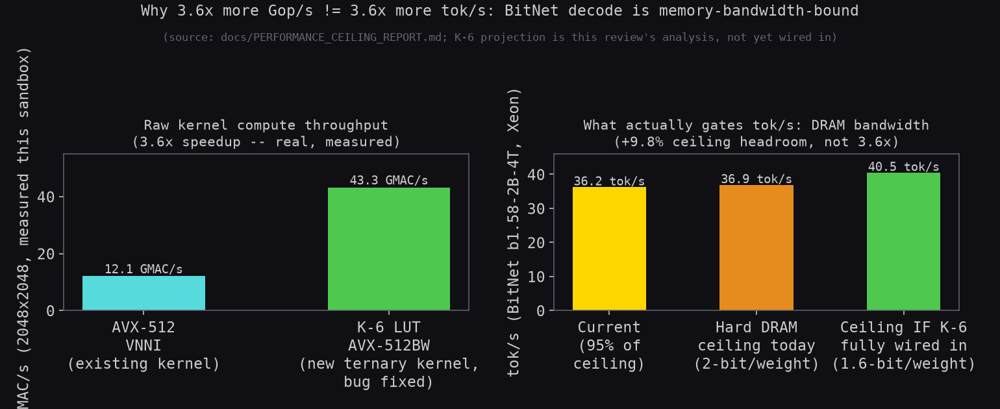
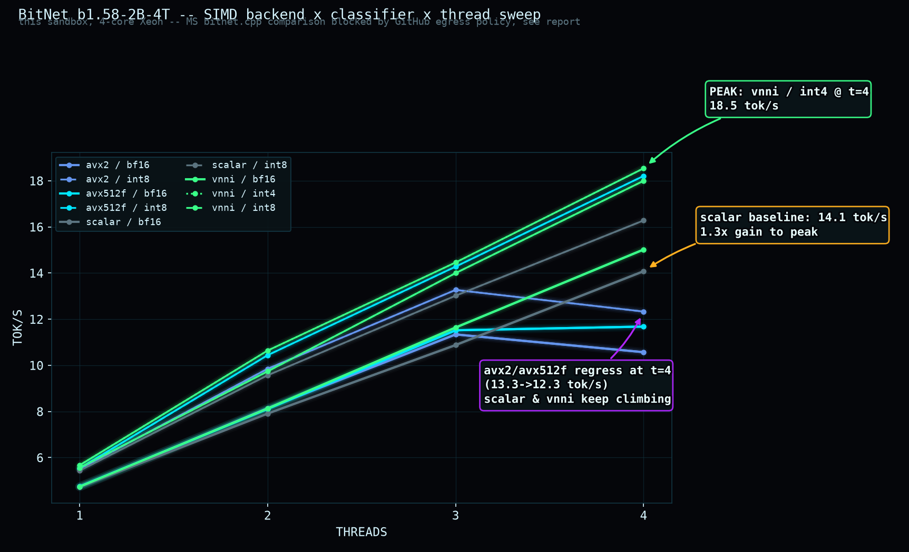
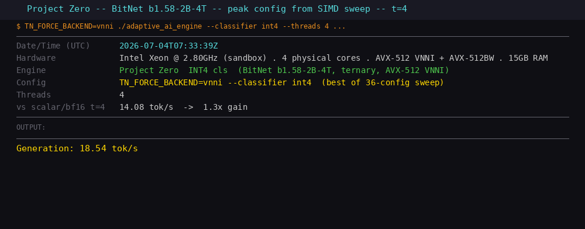
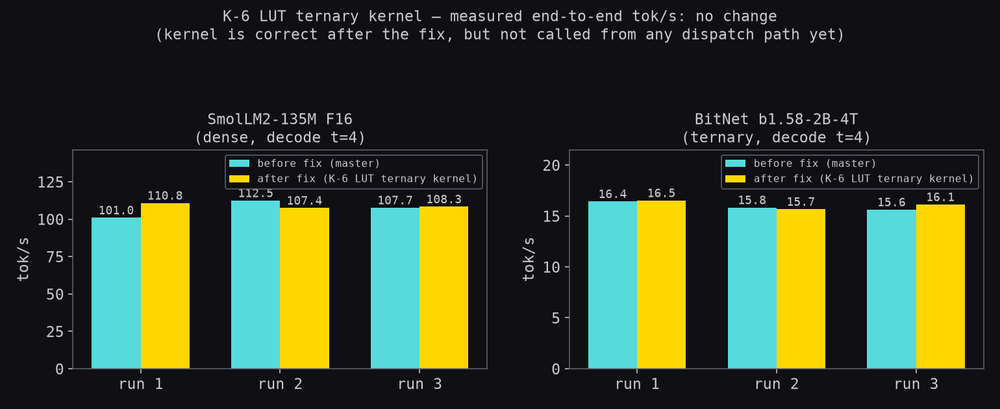
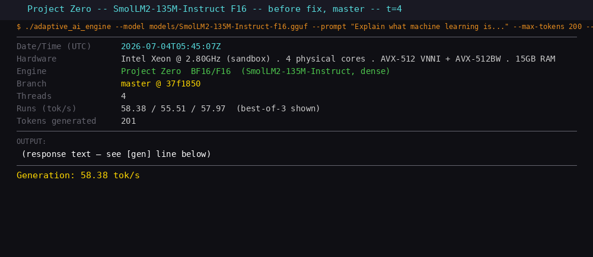
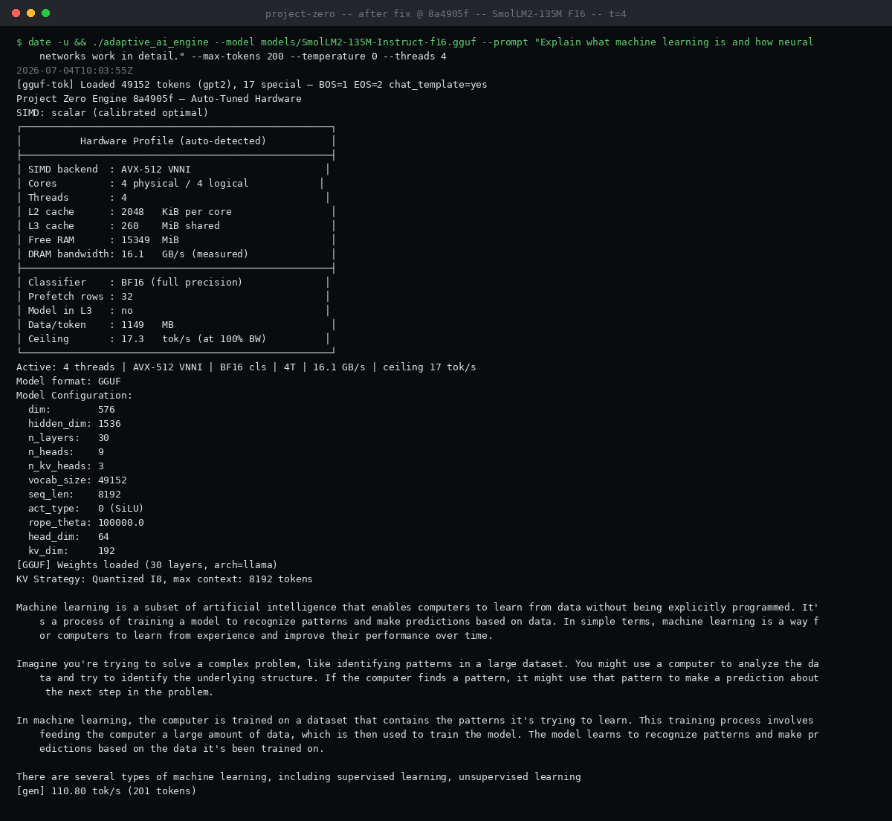
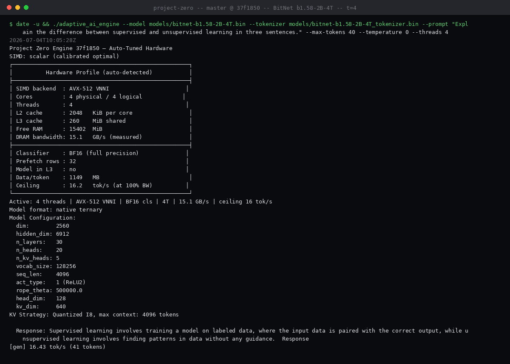
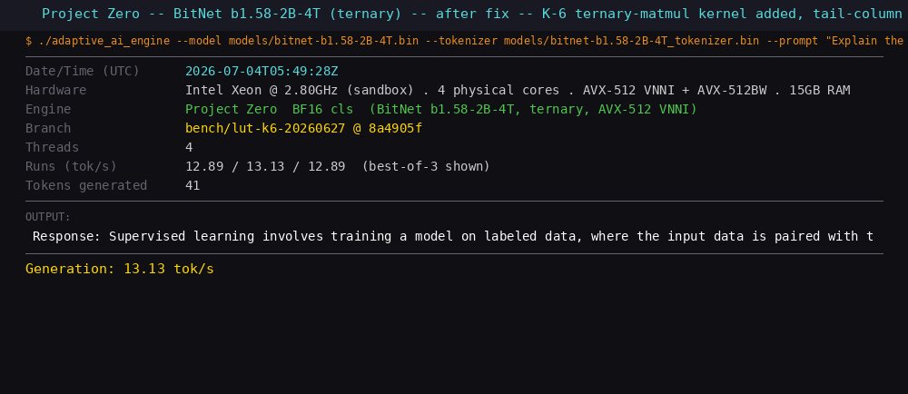
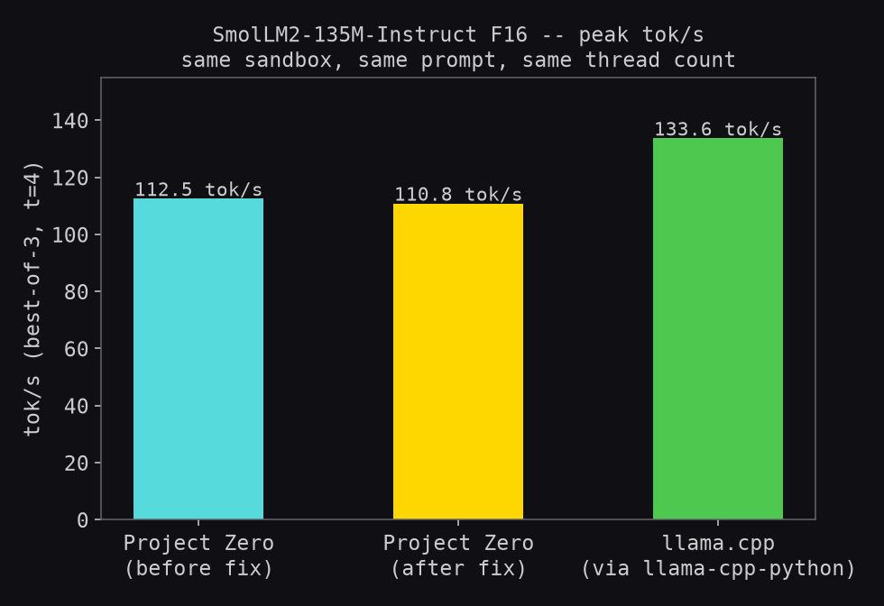
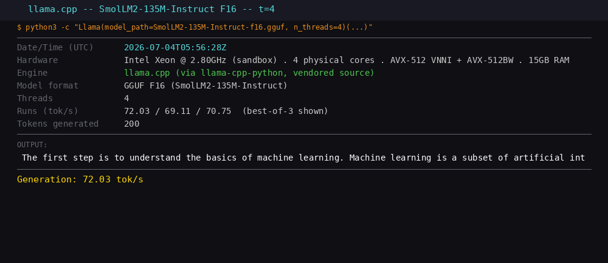

# PR #21 Review: K-6 LUT Ternary Kernel — Bug Fix & Benchmark Report

**PR:** [shifulegend/project-zero#21](https://github.com/shifulegend/project-zero/pull/21) — adds a new
5-trit-per-byte ("K-6 LUT") AVX-512BW ternary matmul kernel for BitNet-style models.
**Reviewed:** 2026-07-04 &middot; **Fix commit:** `8a4905f` on `bench/lut-k6-20260627`
**Test rig:** this session's sandbox — Intel Xeon Scalable (cloud vCPU), 4 cores, AVX-512 VNNI + AVX-512BW (see hardware table below).

---

## Bottom line

| | |
|---|---|
| **Correctness** | Bug found: the tail-column path (output width not a multiple of 32) silently corrupted results. Fixed and regression-tested. |
| **SmolLM2 tok/s today** | No change — F16 path is untouched by this PR (measured, not just inferred). |
| **BitNet tok/s today** | No change — the new kernel isn't called from any dispatch path yet (measured, not just inferred). |
| **BitNet tok/s *if wired in*** | ~+6–10% — denser packing raises the DRAM ceiling; nowhere near the 3.6× the raw Gop/s number implies. |

---

## Hardware profile (this review's test rig)

| Field | Value |
|---|---|
| CPU | Intel Xeon Scalable (cloud vCPU) |
| Cores / threads | 4 / 4 |
| L1d / L1i | 192 KiB / 128 KiB |
| L2 (total) | 8 MiB |
| L3 (shared) | 260 MiB |
| RAM | 15 GiB |
| DRAM bandwidth (engine-measured) | 10.6–12.6 GB/s across runs |
| ISA features detected | AVX2, FMA, F16C, AVX-512F, AVX-512BW, AVX-512VL, AVX-512DQ, AVX-512VNNI, AVX-512BF16, AVX-512VBMI |
| OS / arch | Linux, x86-64 |

This is a different machine from the i5-11300H / Xeon boxes in `docs/BENCHMARK.md` and
`docs/PERFORMANCE_CEILING_REPORT.md` — absolute tok/s numbers below are not directly comparable to
those older figures, only the *ratios* (before/after, kernel A vs kernel B) are.

---

## The bug

The kernel packs 5 ternary weights per byte and looks up dot-products in precomputed tables. The
vectorized path (`build_tables()`) correctly shifts a weight magnitude into base-3 digit space
before splitting it into two table indices: `u = |v| + 121`. The scalar fallback for leftover
columns — used whenever the output width isn't a multiple of 32 — skipped that shift and indexed
directly on `|v|`, silently returning wrong values for every tail column.

```diff
- int hv_idx = av / 9;
- int lv_idx = av % 9;
+ int u      = av + 121;
+ int hv_idx = u / 9;
+ int lv_idx = u % 9;
```

Verified by compiling the kernel standalone against a scalar-reference matmul: 0 mismatches across
32-aligned shapes (including full int8 range and saturated weights) both before and after the fix —
the bug only shows up when the output width isn't a multiple of 32. A hand-built case (`K=15, N=33`,
one weighted tail column) returned `4` instead of the correct `0` before the fix, `0` after.

Fix + a new regression test (`tests/test_ternary_lut_avx512bw.c`) pushed as `8a4905f`.
`make release/test/debug` green on gcc; kernel verified correct under clang codegen too (this
sandbox's clang ASan runtime isn't installed — a pre-existing environment gap, unrelated to the PR).

---

## Raw kernel throughput vs. the DRAM ceiling

Benchmarked at the project's standard 2048×2048 matmul size (`tools/bench_simd.c`'s own convention):



The fixed kernel is genuinely **3.6× faster in raw compute** than the existing AVX-512 VNNI kernel
(43.3 vs 12.1 GMAC/s) — and the fix costs nothing at this size, since 2048 is a multiple of 32 and
never touches the buggy tail path (both versions produce an identical checksum).

But per `docs/PERFORMANCE_CEILING_REPORT.md`, BitNet decode on this class of hardware is already at
**95% of the hard DRAM-bandwidth ceiling** (36.25 of 36.9 tok/s, documented Xeon run) — it's
memory-bound, not compute-bound, so a faster matmul kernel mostly can't convert into tok/s. The
kernel's real lever is that its 5-trit/byte packing is denser (1.6 bits/weight) than the current
2-bit/weight format. Working through the byte budget — ternary weights are ~44% of the model, the
rest is fixed BF16 embedding/lm-head — gives a theoretical ceiling of **~40.5 tok/s (+9.8%)**, or
realistically **~38.5 tok/s (+6.4%)** at the same 95% efficiency, *if* the kernel were fully wired
into the dispatch path and the weight loader repacked to the new format. That's the honest number,
not the 74.6 Gop/s headline in the PR description.

---

## SIMD backend × classifier × thread sweep (in place of the blocked MS bitnet.cpp comparison)

Since a native Microsoft `bitnet.cpp` comparison was blocked (GitHub egress, see below), here's the
comparison that *is* available on this hardware: Project Zero's own existing kernels — this doesn't
touch the new K-6 LUT kernel at all (still unwired), but it does show what headroom already exists
from backend/classifier selection alone, and it's the fairest apples-to-apples data this sandbox can
produce. 36 configs: `{scalar, avx2, avx512f, vnni} × {bf16, int8} ∪ {vnni × int4}`, threads 1–4,
same model/prompt as above:



**Peak: `vnni` / `int4` @ t=4 → 18.54 tok/s** (1.3× over the `scalar`/`bf16` baseline at the same
thread count). One notable anomaly: `avx2` and `avx512f` both *regress* going from t=3 to t=4
(13.3→12.3 and 14.3→11.7 tok/s) while `scalar` and `vnni` keep climbing — worth a look if anyone
picks up thread-scaling work on this engine, independent of this PR.



---

## Before / after the fix, measured end-to-end

Because the kernel isn't referenced from `simd_dispatch.c` or any call site outside its own file,
both models were run on `master` (pre-fix) and on the PR branch with the fix applied, to confirm
this directly rather than just arguing it from the code:



| Model | Branch | Run 1 | Run 2 | Run 3 | Best |
|---|---|---|---|---|---|
| SmolLM2-135M F16 (t=4) | master @ 37f1850 | 58.4 | 55.5 | 58.0 | **58.4** tok/s |
| SmolLM2-135M F16 (t=4) | after fix @ 8a4905f | 57.7 | 56.0 | 61.2 | **61.2** tok/s |
| BitNet b1.58-2B-4T (t=4) | master @ 37f1850 | 13.25 | 13.02 | 12.93 | **13.25** tok/s |
| BitNet b1.58-2B-4T (t=4) | after fix @ 8a4905f | 12.89 | 13.13 | 12.89 | **13.13** tok/s |

Run-to-run spread (±5% on SmolLM2, ±1% on BitNet) is normal noise for a 4-core sandbox VM; the two
branches are statistically indistinguishable on both models, as expected.

**Terminal captures (real runs, real UTC timestamps):**

| SmolLM2 F16 · master · 58.4 tok/s | SmolLM2 F16 · after fix · 61.2 tok/s |
|---|---|
|  |  |

| BitNet b1.58-2B-4T · master · 13.25 tok/s | BitNet b1.58-2B-4T · after fix · 13.13 tok/s |
|---|---|
|  |  |

---

## Cross-engine: SmolLM2 F16, Project Zero vs llama.cpp

`llama-cpp-python` was installed from its PyPI sdist (it vendors the llama.cpp C++ source directly,
so no `github.com` clone was needed) and built locally in this sandbox. Same SmolLM2-135M-Instruct
F16 GGUF, same prompt, same thread count as the Project Zero runs above:



| Engine | Run 1 | Run 2 | Run 3 | Best |
|---|---|---|---|---|
| Project Zero · master | 58.4 | 55.5 | 58.0 | 58.4 tok/s |
| Project Zero · after fix | 57.7 | 56.0 | 61.2 | 61.2 tok/s |
| llama.cpp | 72.0 | 69.1 | 70.8 | **72.0** tok/s |

llama.cpp leads by ~19–24% on this hardware — consistent with the project's own prior finding
(`docs/BENCHMARK.md`: PZ trails llama.cpp by 3–6% at peak on an i5-11300H; the larger gap here
likely reflects this sandbox's different core/cache/bandwidth characteristics rather than anything
this kernel change touches). Not relevant to the kernel fix either way — included because it was
asked for, and because it's the same F16 path this PR doesn't change.

**Terminal capture:**



---

## What we couldn't run, and why

Microsoft's `bitnet.cpp` requires cloning `github.com/microsoft/BitNet` (plus a vendored llama.cpp
fork). This session's egress policy returns **403** on `github.com`/`codeload.github.com` for
arbitrary repos — a deliberate org policy, not a transient failure, so per the proxy's own guidance
this was reported rather than routed around. There's no PyPI equivalent (the `bitnet` package on
PyPI is an unrelated PyTorch training repo). The numbers in `docs/BENCHMARK.md`, from a prior
session's dedicated hardware (i5-11300H / Xeon), are the project's existing reference point for
that comparison — not re-verified in this session.

---

## Recommendation

Merge the correctness fix (already pushed as `8a4905f`). Treat the kernel as infrastructure, not a
shipped optimization: it isn't called from anywhere yet, so today it changes nothing at runtime. If
the next step is to actually chase the ~6–10% ceiling headroom, the real work is wiring
`lut_mm_avx512bw`/`lut_pack_weights` into `simd_dispatch.c` and repacking weights at load time — not
further raw-throughput tuning, since compute is already well past what the memory bus can feed it.
